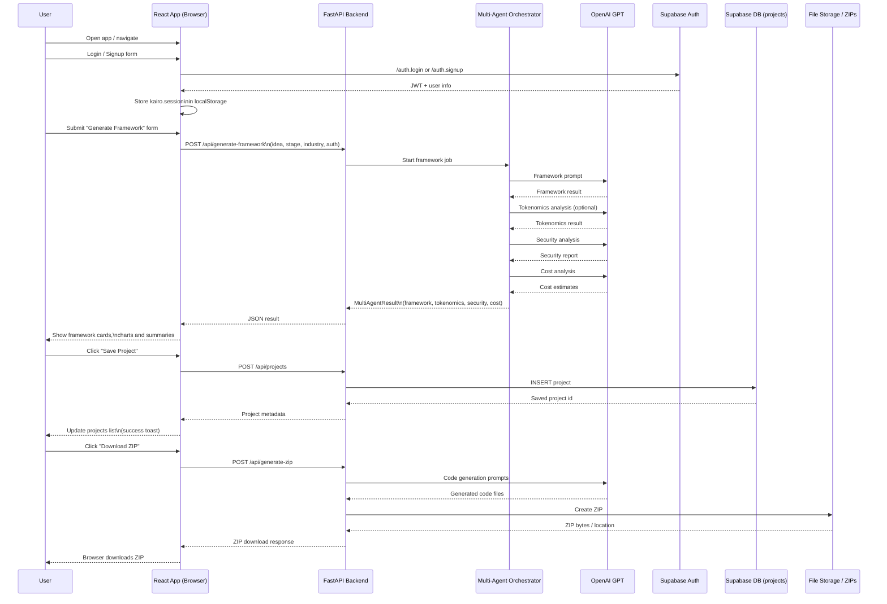

# PatriotHacks
2025 Patriot Hacks Submission - "Kairo.ai"

# Architecture


# Web3 Framework Generator

Turn any Web2 business idea into a Web3-ready starter kit with AI-generated architecture, optional smart contracts, and a downloadable ZIP you can launch from.

---

## What it does

Users describe their business idea to an AI agent, which processes it and generates a complete Web3-ready framework, including suggested architecture, features, and optional smart contracts. The system uses saved projects and past inputs to personalize each build and refine future recommendations. If the user wants blockchain functionality, the backend compiles and deploys Solidity contracts to a testnet and packages everything into a ready-to-use starter kit. Users can download their ZIP bundle, revisit previous builds, and track how their project evolves over time as they iterate with the AI.

---

## How we built it

- **AI pipeline** – OpenAI powers the reasoning flow that takes a rough idea and turns it into a structured framework and contract templates.
- **Web3 integration** – `web3.py` compiles and deploys Solidity contracts to a testnet using RPC + private key from environment variables, then bundles ABI, bytecode, and starter scripts.
- **Auth & storage** – Supabase handles user authentication and persists project history so users can come back and keep building.
- **Backend** – Python backend using Flask, exposing endpoints for generating frameworks, deploying contracts, and generating ZIPs.
- **Frontend** – React frontend that sends user input to the API, displays the generated framework, and lets users download ZIPs or open saved projects.

Deploying to a testnet proves the contracts actually compile and deploy, and gives users a live example to inspect before they launch their own production version from the ZIP.

---

## Tech stack

- **Frontend:** React, JavaScript/TypeScript
- **Backend:** Python, Flask
- **AI:** OpenAI API
- **Web3:** Solidity, `web3.py`, EVM testnet (e.g., Sepolia/Base Sepolia)
- **Auth & DB:** Supabase
- **Packaging:** Python `zipfile` (ZIP generator)

---

## Getting started

### Prerequisites

- Node.js (LTS)
- Python 3.10+
- A Supabase project (URL + anon key)
- OpenAI API key
- EVM testnet RPC URL + funded wallet private key (testnet only)

### Environment variables

Create a `.env` file in the backend folder with something like:

```env
OPENAI_API_KEY=your_openai_key
SUPABASE_URL=your_supabase_url
SUPABASE_ANON_KEY=your_supabase_anon_key

RPC_URL=https://sepolia.infura.io/v3/your_project_id
PRIVATE_KEY=your_testnet_private_key
CONTRACT_NETWORK_NAME=sepolia
