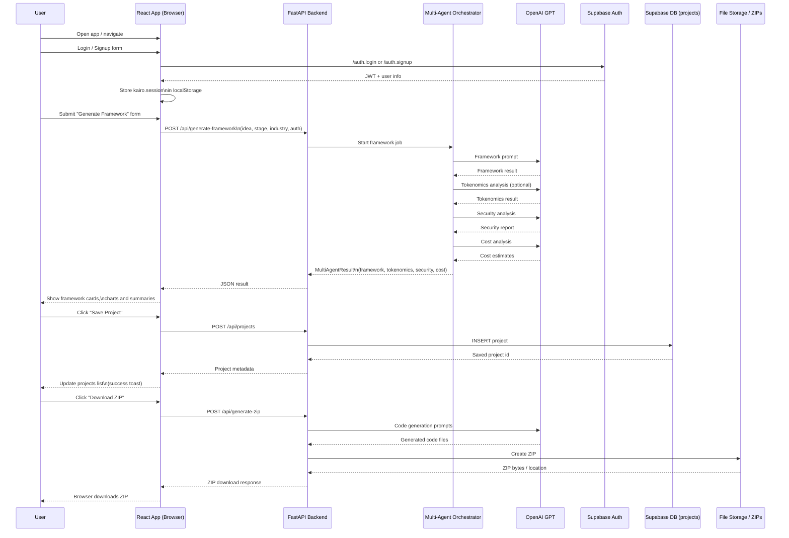

# PatriotHacks
2025 Patriot Hacks Submission - "Kairo.ai"

# Architecture


# Web3 Framework Generator

Turn any Web2 business idea into a Web3-ready starter kit with AI-generated architecture, optional smart contracts, and a downloadable ZIP you can launch from.

---

## What it does

Users describe their business idea to an AI agent, which processes it and generates a complete Web3-ready framework, including suggested architecture, features, and optional smart contracts. The system uses saved projects and past inputs to personalize each build and refine future recommendations. If the user wants blockchain functionality, the backend compiles and deploys Solidity contracts to a testnet and packages everything into a ready-to-use starter kit. Users can download their ZIP bundle, revisit previous builds, and track how their project evolves over time as they iterate with the AI.

---

## How we built it

- **AI pipeline** – OpenAI powers the reasoning flow that takes a rough idea and turns it into a structured framework and contract templates.
- **Web3 integration** – `web3.py` compiles and deploys Solidity contracts to a testnet using RPC + private key from environment variables, then bundles ABI, bytecode, and starter scripts.
- **Auth & storage** – Supabase handles user authentication and persists project history so users can come back and keep building.
- **Backend** – Python backend using Flask, exposing endpoints for generating frameworks, deploying contracts, and generating ZIPs.
- **Frontend** – React frontend that sends user input to the API, displays the generated framework, and lets users download ZIPs or open saved projects.

Deploying to a testnet proves the contracts actually compile and deploy, and gives users a live example to inspect before they launch their own production version from the ZIP.

---

## Tech stack

- **Frontend:** React, JavaScript/TypeScript
- **Backend:** Python, Flask
- **AI:** OpenAI API
- **Web3:** Solidity, `web3.py`, EVM testnet (e.g., Sepolia/Base Sepolia)
- **Auth & DB:** Supabase
- **Packaging:** Python `zipfile` (ZIP generator)

---
Here’s a clean, professional **README.md** you can paste directly into your GitHub repo.
It explains **how to run the frontend, backend, environment variables, Supabase auth, ZIP generation, and the multi-agent pipeline**.

---

# Kairo.ai – Web3 Project Framework Generator

Multi-agent Web3 builder that generates product frameworks, tokenomics, smart-contract outlines, architecture plans, and auto-generated ZIP bundles.

---

## Features

* Multi-agent system (Framework, Tokenomics, Security, Cost)
* React frontend with animated UI + routing
* FastAPI backend with OpenAI integration
* Supabase authentication (login, signup, reset password)
* Save & load user projects
* ZIP code generation pipeline
* Tokenomics donut charts
* Build history / Stored Zips dashboard

---

# ⚙️ **Tech Stack**

### **Frontend**

* React + Vite / CRA
* React Router
* Tailwind + shadcn UI
* LocalStorage session management
* Tokenomics SVG donut chart

### **Backend**

* FastAPI
* Python 3.10+
* Supabase JWT verification
* OpenAI API (GPT models)
* ZIP code assembly pipeline

### **Database / Auth**

* Supabase Auth
* Supabase Postgres
* Supabase Storage

---

# 🔧 **Prerequisites**

Make sure you have the following installed:

| Tool             | Version     |
| ---------------- | ----------- |
| Node.js          | ≥ 18        |
| Python           | ≥ 3.10      |
| pip / venv       | recommended |
| Supabase Project | required    |
| OpenAI API Key   | required    |

---

# 📦 **Environment Variables**

## 🖥️ Frontend (`.env`)

```
REACT_APP_API_URL=http://localhost:8000
REACT_APP_SUPABASE_URL=YOUR_SUPABASE_URL
REACT_APP_SUPABASE_ANON_KEY=YOUR_SUPABASE_ANON_KEY
```

## 🐍 Backend (`.env`)

```
OPENAI_API_KEY=your_openai_key
SUPABASE_URL=your_supabase_url
SUPABASE_SERVICE_ROLE_KEY=your_service_role_key
SUPABASE_JWT_SECRET=your_jwt_secret
```

---

# ▶️ **Running the Project**

## 1. Clone the repository

```bash
git clone https://github.com/yourusername/kairo-ai.git
cd kairo-ai
```

---

# 🖥️ **Frontend Setup (React)**

## Install dependencies

```bash
cd frontend
npm install
```

## Start development server

```bash
npm start
```

Your frontend will run at:

👉 **[http://localhost:3000](http://localhost:3000)**

---

# 🐍 **Backend Setup (FastAPI)**

## Create virtual environment

```bash
cd backend
python3 -m venv venv
source venv/bin/activate      # Mac/Linux
venv\Scripts\activate         # Windows
```

## Install dependencies

```bash
pip install -r requirements.txt
```

## Start FastAPI server

```bash
uvicorn main:app --reload --port 8000
```

Your backend will run at:

👉 **[http://localhost:8000](http://localhost:8000)**

OpenAPI docs available at:

👉 **[http://localhost:8000/docs](http://localhost:8000/docs)**

---

# **Supabase Setup**

### 1. Create Supabase project

### 2. Enable Authentication (email/password)

### 3. Create `projects` table:

```sql
create table projects (
    id uuid primary key default gen_random_uuid(),
    user_id uuid references auth.users(id),
    name text,
    idea text,
    result jsonb,
    created_at timestamp default now()
);
```

### 4. Add Row Level Security policies:

```sql
-- Select only own projects
create policy "Select own" on projects
for select using (auth.uid() = user_id);

-- Insert only for own user
create policy "Insert own" on projects
for insert with check (auth.uid() = user_id);

-- Update only own
create policy "Update own" on projects
for update using (auth.uid() = user_id);

-- Delete only own
create policy "Delete own" on projects
for delete using (auth.uid() = user_id);
```

---

# **Multi-Agent Flow**

When the user submits their idea:

1. **Framework Agent**

   * Generates product architecture
   * Defines frontend/backend/smart-contract components

2. **Tokenomics Agent**

   * Creates allocation table
   * Generates donut chart-friendly data

3. **Security Agent**

   * Threat modeling
   * Smart contract risks

4. **Cost Agent**

   * Estimated dev cost
   * Tooling & infra

5. FastAPI merges results & returns final JSON

6. React displays cards + charts

---

# **ZIP Generator**

When the user clicks **Download ZIP**:

1. React sends payload → `/api/generate-zip`
2. Backend calls OpenAI to generate code:

   * frontend code
   * backend scaffolding
   * smart-contract templates
3. Backend assembles ZIP via `zipfile`
4. Returns Base64 ZIP → browser triggers download

---

# **Project Structure**

```
kairo-ai/
│
├── frontend/          # React app
│   ├── src/
│   ├── components/
│   ├── pages/
│   ├── App.js
│   └── ...
│
├── backend/           # FastAPI backend
│   ├── main.py
│   ├── routers/
│   ├── agents/
│   └── ...
│
└── README.md
```

---

# **Testing**

Frontend:

```bash
npm test
```

Backend:

```bash
pytest
```

---

# 🌐 **Production Deployment**

### Frontend:

* Vercel / Netlify / S3 + CloudFront

### Backend:

* Railway / Render / Fly.io / EC2
* Requires environment variables

### Supabase:

* Hosted automatically
